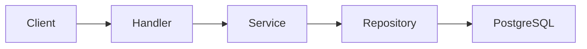

# API Architecture

The Go API is built with the Gin framework and serves as the single backend for both web and mobile clients.

## Structure

```
apps/api/
├── api/             # OpenAPI spec (generated)
├── cmd/server/      # Entry point (main.go)
├── config/          # Configuration
├── db/
│   ├── migrations/  # Goose SQL migrations
│   └── queries/     # sqlc query definitions
└── internal/
    ├── handler/     # HTTP endpoints
    ├── middleware/   # HTTP middleware
    ├── model/       # Domain models
    ├── repository/  # Generated sqlc code
    └── service/     # Business logic
```

## Request Flow



Handlers parse HTTP requests and delegate to services. Services contain business logic. Repositories are generated by sqlc and handle database access.

## Code Generation

The API participates in a three-step generation pipeline:

1. **SQL → Go:** `db/queries/*.sql` → sqlc → `internal/repository/`
2. **Go → OpenAPI:** Handler annotations → openapi-gen → `api/openapi.yaml`

Run `task generate` to execute all steps, or individual steps with `task generate:sqlc`, `task generate:openapi`.

## Adding an Endpoint

See the [Adding a New API Endpoint](../../../../CLAUDE.md#adding-a-new-api-endpoint) section in CLAUDE.md.

## Endpoint Reference

See [`apps/api/api/openapi.yaml`](../../../../apps/api/api/openapi.yaml) for the full API reference.

## Database Schema

See [database.md](./database.md) for table definitions, constraints, and migration details.
