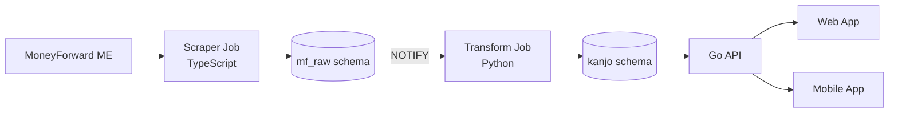

# Data Pipeline Architecture

This document describes Kanjo's data pipeline architecture for ingesting, transforming, and serving financial transaction data from MoneyForward ME.

## Overview



## Schema Separation

The database uses two PostgreSQL schemas to separate concerns:

### mf_raw Schema (Scraper-Owned)

Raw data from MoneyForward, owned and written by the scraper job. The API and transform job read from this schema but never write to it.

| Table                 | Description                      |
| --------------------- | -------------------------------- |
| `mf_raw.transactions` | Raw transactions from CSV export |
| `mf_raw.daily_assets` | Daily balance snapshots          |
| `mf_raw.mf_session`   | Browser session persistence      |
| `mf_raw.job_runs`     | Scraper job execution history    |

### kanjo Schema (App-Owned)

Normalized and enriched data for the application. Written by the transform job, read by the API.

| Table                      | Description                                                |
| -------------------------- | ---------------------------------------------------------- |
| `kanjo.transactions`       | Transformed transactions with category/merchant references |
| `kanjo.categories`         | Category definitions (seeded)                              |
| `kanjo.merchants`          | Normalized merchant registry                               |
| `kanjo.institutions`       | Financial institution metadata                             |
| `kanjo.daily_assets`       | Transformed asset snapshots                                |
| `kanjo.transfer_pairs`     | Matched transfer pairs                                     |
| `kanjo.recurring_patterns` | Detected recurring transactions                            |
| `kanjo.transform_runs`     | Transform job execution history                            |
| `kanjo.budget_*`           | Budget tracking tables                                     |
| `kanjo.savings_goals`      | User savings goals                                         |
| `kanjo.insights`           | AI-generated insights                                      |

## Event Coordination

The scraper and transform jobs communicate via PostgreSQL `LISTEN/NOTIFY`:

1. Scraper completes a job run
2. Database trigger fires `NOTIFY mf_job_completed`
3. Transform job (in listen mode) receives notification
4. Transform processes new transactions

```sql
-- Trigger on mf_raw.job_runs
CREATE FUNCTION mf_raw.notify_job_completed() RETURNS TRIGGER AS $$
BEGIN
    IF NEW.status = 'completed' AND OLD.status = 'running' THEN
        PERFORM pg_notify('mf_job_completed', json_build_object(
            'job_id', NEW.id,
            'job_type', NEW.job_type,
            'transactions_count', NEW.transactions_count
        )::text);
    END IF;
    RETURN NEW;
END;
$$ LANGUAGE plpgsql;
```

## Transform Pipeline

The transform job processes raw transactions and writes normalized data to the kanjo schema.

### Processing Flow

1. **Trigger**: LISTEN for `mf_job_completed` or manual CLI invocation
2. **Fetch**: Get untransformed transactions (those in `mf_raw` but not in `kanjo`)
3. **Transform each transaction**:
   - Resolve merchant (cache → rules → LLM)
   - Resolve category (rules → LLM)
   - Record confidence scores
4. **Post-processing**: Match transfer pairs
5. **Persist**: Upsert to `kanjo.transactions`

### Merchant Resolution

Order of resolution:

1. **Cache**: Check if merchant already exists for this description
2. **Rules**: Apply pattern matching (regex-based)
3. **LLM**: Call LLM for normalization (if enabled)
4. **Fallback**: Use raw description as-is

### Category Resolution

Order of resolution:

1. **Direct mapping**: Map MoneyForward 大項目 to Kanjo category
2. **Subcategory rules**: Use 中項目 for finer classification
3. **LLM**: Call LLM for ambiguous cases (if enabled)
4. **Fallback**: Mark as uncategorized

## ML/LLM Strategy

### Phased Approach

```
Phase 1 (Now):   Rules (high confidence) + LLM (fallback) → User reviews
Phase 2 (Later): Train lightweight model on accumulated user corrections
Phase 3 (Future): Custom model replaces LLM (faster, cheaper)
```

### Why This Approach

- **No training data initially**: LLM provides zero-shot categorization
- **User corrections accumulate**: Each override becomes training data
- **Cost reduction over time**: Custom models replace expensive LLM calls

### LLM Configuration (OpenRouter)

The transform job uses [OpenRouter](https://openrouter.ai) for LLM access. OpenRouter provides a single API that routes to multiple providers (OpenAI, Anthropic, Google, etc.).

```bash
cp jobs/transform/.env.example jobs/transform/.env
```

Configure in `.env`:

```bash
OPENROUTER_API_KEY=sk-or-...              # Get from https://openrouter.ai/keys
LLM_MODEL=anthropic/claude-haiku-4.5      # OpenRouter model ID
```

Recommended models (small/fast):

| Model ID                     | Provider  | Notes                 |
| ---------------------------- | --------- | --------------------- |
| `anthropic/claude-haiku-4.5` | Anthropic | Default, best balance |
| `openai/gpt-4o-mini`         | OpenAI    | Good alternative      |
| `google/gemini-2.5-flash`    | Google    | Stable, fast          |

Larger models (if needed):

| Model ID                    | Provider  |
| --------------------------- | --------- |
| `anthropic/claude-sonnet-4` | Anthropic |
| `openai/gpt-4o`             | OpenAI    |
| `google/gemini-2.5-pro`     | Google    |

See [OpenRouter Models](https://openrouter.ai/models) for full list.

### Transform Configuration

| Variable                | Default                      | Description                                     |
| ----------------------- | ---------------------------- | ----------------------------------------------- |
| `DATABASE_URL`          | (required)                   | PostgreSQL connection URL                       |
| `OPENROUTER_API_KEY`    | None                         | OpenRouter API key. If not set, runs rules-only |
| `LLM_MODEL`             | `anthropic/claude-haiku-4.5` | OpenRouter model ID                             |
| `LOG_LEVEL`             | `INFO`                       | DEBUG, INFO, WARNING, ERROR                     |
| `BATCH_SIZE`            | None                         | Max transactions per run (None = unlimited)     |
| `MAX_LLM_CALLS_PER_RUN` | None                         | Max LLM calls per run (None = unlimited)        |

#### Error Handling

- **Retries**: LLM calls retry 3 times with exponential backoff (1s, 2s, 4s)
- **JSON parsing**: Handles markdown code blocks and malformed responses
- **Fallback**: If LLM fails after retries, uses rule-based categorization

#### Uncategorized Transactions

When MoneyForward marks a transaction as "未分類":

1. Transform tries LLM categorization first (low rule confidence)
2. Falls back to `expense-uncategorized` if LLM fails
3. User can manually correct in the app

## Running the Pipeline

### Prerequisites

The transform job uses Python with `uv` for package management. **Do not use pip or requirements.txt.**

```bash
# Install dependencies
cd jobs/transform
uv sync

# Copy and configure environment
cp .env.example .env
# Edit .env with your API keys (optional - rule-based works without LLM)
```

### Local Development

```bash
# Start database
task dev:db
task migrate

# Run scraper
task scraper:fetch

# Run transform (one-time)
task transform:run

# Run transform (listener mode)
task transform:listen

# Backfill all transactions
task transform:backfill
```

All transform tasks use `uv run` internally (see `Taskfile.yml`).

### Docker Compose

```bash
# Start all services
docker compose --profile scraper --profile transform up

# Run transform only
docker compose --profile transform up transform
```

## Monitoring

### Scraper Jobs

Query `mf_raw.job_runs`:

```sql
SELECT job_type, status, transactions_count, started_at, completed_at
FROM mf_raw.job_runs
ORDER BY started_at DESC
LIMIT 10;
```

### Transform Runs

Query `kanjo.transform_runs`:

```sql
SELECT status, transactions_processed, transactions_transformed,
       merchants_created, llm_calls_made, started_at, completed_at
FROM kanjo.transform_runs
ORDER BY created_at DESC
LIMIT 10;
```

### Data Quality

Check transformation coverage:

```sql
-- Untransformed transactions
SELECT COUNT(*) as pending
FROM mf_raw.transactions r
LEFT JOIN kanjo.transactions t ON t.raw_hash = r.hash
WHERE t.hash IS NULL;

-- Category confidence distribution
SELECT
    CASE
        WHEN category_confidence >= 90 THEN 'high'
        WHEN category_confidence >= 70 THEN 'medium'
        ELSE 'low'
    END as confidence_level,
    COUNT(*)
FROM kanjo.transactions
GROUP BY 1;
```
